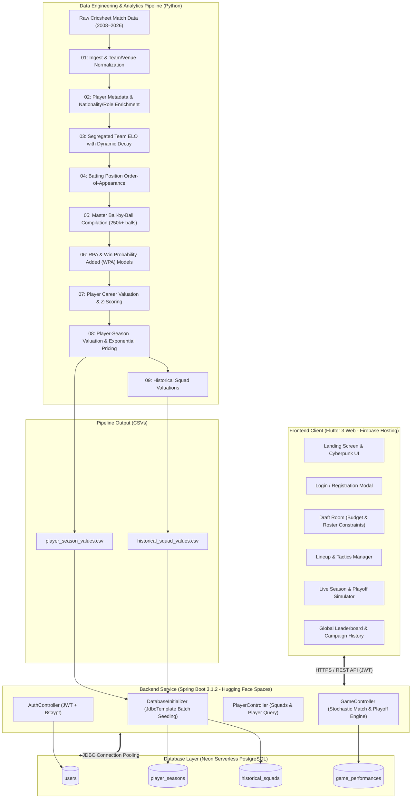

<div align="center">

# 🏏 CricManager
### *Moneyball for the Indian Premier League*

**An End-to-End IPL Cricket Management, Econometric Valuation & Tournament Simulation Engine**

[](https://spring.io/projects/spring-boot)
[](https://openjdk.org/)
[](https://flutter.dev/)
[](https://neon.tech/)
[](https://www.python.org/)
[](https://www.docker.com/)
[](LICENSE)

[🎮 Live Web App](https://cricmanagernow.web.app) • [🚀 API Backend](https://adityx10-crickmanager.hf.space) • [🤗 Hugging Face Space](https://huggingface.co/spaces/adityx10/CrickManager) • [💻 GitHub Repo](https://github.com/aditya-10k/crickmanager)

</div>

---

## 📌 Executive Summary

**CricManager** translates sabermetric principles to T20 cricket. Drawing inspiration from Billy Beane's Oakland Athletics revolution ("Moneyball"), CricManager extracts mathematical value from **18+ years of granular ball-by-ball IPL match data (2008–2026)**.

Traditional fantasy games rely on surface-level vanity metrics (total runs, wickets, strike rate). CricManager calculates **Runs Prevented/Added (RPA)**, **Win Probability Added (WPA)**, **Leverage Index (Clutch)**, and **Opponent-Adjusted Dynamic ELO Decay** to evaluate true player impact.

Managers take the helm of a franchise:
1. **Drafting** a 12-man squad under a strict **₹100 Crore salary cap** while respecting overseas quotas and role constraints.
2. **Setting tactical lineups** (batting order, wicketkeeper, pace/spin bowling attack).
3. **Simulating full double round-robin seasons and official 4-team IPL Playoff tournaments** driven by a server-side stochastic match engine.
4. **Climbing the Global Leaderboards** with persistent career statistics backed by Neon Cloud PostgreSQL.

---

## 🌟 Key Features

### 🎯 1. Econometric Player Valuation & Ratings
* **Contextual Impact Modeling**: Evaluates deliveries based on match phase (Powerplay `0–6`, Middle `6–15`, Death `15–20`), required run rate, and wickets in hand.
* **Clutch Leverage Rating**: Measures performance in high-stakes pressure situations ($|\text{WPA}| \ge 0.04$).
* **Normalized 50–99 Scale**: Normalized peer-relative Z-score ratings for Batting, Bowling, Clutch, and Overall abilities:
  $$\text{Rating} = \text{clip}\left(75.0 + 8.0 \cdot Z, \, 50.0, \, 99.0\right)$$
* **Moneyball Exponential Pricing Curve**: Dynamically scales auction valuations from base tier (₹20 Lakhs) to elite superstar prices (₹15–₹18 Crores) under realistic IPL market economics.

### ⚖️ 2. Strategic Draft Room & Auction Console
* **Purse Management**: Manage a strict **₹100.00 Crore salary cap**.
* **Roster Constraint Validation**:
  * Exactly **12 players** drafted per squad.
  * At least **1 dedicated Wicketkeeper (WK)**.
  * At least **4 dedicated Bowlers / All-Rounders**.
  * At least **1 Spin Bowler** (Legbreak, Offbreak, Slow Left-arm).
  * Maximum **5 Overseas (Foreign) players** in the 12-man squad.
* **Instant Filtering & Search**: Filter by role (BAT, BOWL, AR, WK), nationality (Indian vs Overseas), budget tiers, and overall ratings.

### 📋 3. Lineup Builder & Tactical Management
* **Starting XI Selection**: Designate 11 starters and 1 bench asset.
* **Foreign Player Quota**: Enforces maximum **4 Overseas players** in the Playing XI.
* **Dynamic Team Strength Aggregation**:
  * **Team Batting Strength**: Weighted average of the top 7 batsmen in the XI.
  * **Team Bowling Strength**: Weighted average of the top 5 bowlers in the XI.
  * **Team Clutch Strength**: Average clutch rating across all 11 players.

### 🎲 4. Server-Side Stochastic Match Engine
* **Zero Client Calculation Rule**: All match outcomes and tournament logic run securely on the Spring Boot backend to ensure integrity.
* **Expected Runs Formulation**:
  $$\text{ExpRuns}_{\text{Home}} = 160.0 + 1.8 \cdot (\text{Bat}_{\text{Home}} - \text{Bowl}_{\text{Away}}) + 0.4 \cdot (\text{Clutch}_{\text{Home}} - 75.0) \pm \delta_{\text{diff}}$$
* **Natural Match Variance**: Stochastic normal distribution noise ($\sigma = 12.0$) with a professional T20 lower-bound sanity clamp ($Score \ge 50$).
* **Dynamic Wicket Distribution**:
  $$\text{ExpWickets} = 5.0 + 0.15 \cdot (\text{Bowl}_{\text{Opp}} - \text{Bat}_{\text{Self}}) + \mathcal{N}(0, 1.5^2), \quad Wickets \in [0, 10]$$
* **Super Over Tie-Breakers**: Built-in sudden-death resolution for tied scores.

### 🏆 5. Full Tournament Progression & Playoff Bracket
* **Double Round-Robin League**: Every franchise plays each opponent twice (Home & Away) across $2 \times (N - 1)$ rounds.
* **Real-Time Standings Table**: Tracks Matches Played (P), Wins (W), Losses (L), and Points (PTS) with automatic tie-breakers.
* **Authentic IPL Playoff System**:
  * **Qualifier 1**: Rank 1 vs Rank 2 $\rightarrow$ Winner advances to Final; loser moves to Qualifier 2.
  * **Eliminator**: Rank 3 vs Rank 4 $\rightarrow$ Winner advances to Qualifier 2; loser is eliminated.
  * **Qualifier 2**: Loser of Q1 vs Winner of Eliminator $\rightarrow$ Winner advances to Final.
  * **Grand Final**: Qualifier 1 Winner vs Qualifier 2 Winner $\rightarrow$ **IPL Champion crowned**!

### 🌐 6. Authentication, Persistence & Global Leaderboards
* **Stateless JWT Security**: BCrypt password encryption with JSON Web Token authentication.
* **Campaign History**: Tracks historical campaign runs, win ratios, championships won, and match records.
* **Global Leaderboard**: Competitive leaderboard ranking managers by championship titles, win percentages, and total campaigns completed.

---

## 🏗️ System Architecture



---

## 🔬 The 9-Stage Data Science Pipeline (`/Pipeline`)

The analytics pipeline transforms raw delivery logs into actionable, mathematically sound player ratings and market valuations.

| Stage | Script | Purpose & Methodology |
|:---:|:---|:---|
| **01** | `01_ingest_raw.py` | Ingests multi-year ball-by-ball deliveries; filters invalid match formats; normalizes rebranded franchises (e.g. *Delhi Daredevils* $\rightarrow$ *Capitals*, *Kings XI Punjab* $\rightarrow$ *Punjab Kings*). |
| **02** | `02_player_metadata.py` | Maps Cricsheet IDs to canonical player names; enriches batting styles (RHB/LHB), bowling styles (Fast, Medium, Spin), nationality classification (Indian vs Overseas), and historical wicketkeeping records. |
| **03** | `03_team_elo.py` | Implements segregated dynamic ELO ratings for all IPL franchises across 18+ seasons, applying intra-season and inter-season recency decay. |
| **04** | `04_batting_positions.py` | Analyzes historical entry points to determine modal batting orders: Top Order (1–3), Middle Order (4–6), and Finishers / Lower Order (7–11). |
| **05** | `05_master_ball_by_ball.py` | Compiles a master dataset (>250,000 deliveries) tagging phase states: **Powerplay** (overs 0–6), **Middle** (overs 6–15), and **Death** (overs 15–20). |
| **06** | `06_rpa_wp_models.py` | Computes **Runs Prevented/Added (RPA)** relative to historical venue/over baselines, and calculates ball-by-ball **Win Probability Added (WPA)** to isolate high-leverage clutch events ($|\text{WPA}| \ge 0.04$). |
| **07** | `07_player_valuation.py` | Aggregates career distributions across role buckets; standardizes metrics using Z-score transformations. |
| **08** | `08_player_season_valuation.py` | Calculates season-specific Batting, Bowling, Clutch, and Overall ratings (50–99 scale). Applies exponential decay curves to model realistic IPL auction salaries. |
| **09** | `09_historical_squad_valuations.py` | Synthesizes historical tournament squads (e.g., MI 2020, CSK 2018, KKR 2014) to create balanced AI opponent benchmarks. |

---

## 📐 Mathematical Formulation

### 1. Z-Score Rating Mapping
To transform raw metric distributions (RPA, WPA, strike rate, economy rate) into an intuitive FIFA/NBA 2K-style rating:
$$\mu = 75.0, \quad \sigma = 8.0$$
$$\text{Rating}_i = \text{clip}\left(75.0 + 8.0 \cdot \left(\frac{x_i - \bar{x}}{s}\right), \, 50.0, \, 99.0\right)$$
An exposure penalty is applied for players with small sample sizes below the qualified qualification threshold.

### 2. Team Strength Aggregation
From the user's Starting XI:
$$\text{BattingStrength} = \frac{1}{7} \sum_{k=1}^{7} \text{batRating}_{(k)} \quad \text{(Top 7 ranked batsmen)}$$
$$\text{BowlingStrength} = \frac{1}{5} \sum_{k=1}^{5} \text{bowlRating}_{(k)} \quad \text{(Top 5 ranked bowlers)}$$
$$\text{ClutchStrength} = \frac{1}{11} \sum_{k=1}^{11} \text{clutchRating}_{(k)} \quad \text{(All 11 starters)}$$

### 3. Match Simulation Score Distribution
$$E[\text{Runs}_{\text{Home}}] = 160.0 + 1.8 \cdot (\text{Bat}_{\text{Home}} - \text{Bowl}_{\text{Away}}) + 0.4 \cdot (\text{Clutch}_{\text{Home}} - 75.0) - \delta_{\text{user\_diff}}$$
$$E[\text{Runs}_{\text{Away}}] = 160.0 + 1.8 \cdot (\text{Bat}_{\text{Away}} - \text{Bowl}_{\text{Home}}) + 0.4 \cdot (\text{Clutch}_{\text{Away}} - 75.0) + \delta_{\text{user\_diff}}$$
$$\text{Score} = \max\left(50, \, \text{round}\left(E[\text{Runs}] + \mathcal{N}(0, 12^2)\right)\right)$$

$$\text{Wickets} = \text{clip}\left(\text{round}\left(5.0 + 0.15 \cdot (\text{Bowl}_{\text{Opp}} - \text{Bat}_{\text{Self}}) + \mathcal{N}(0, 1.5^2)\right), \, 0, \, 10\right)$$

---

## 🛠️ Technology Stack

| Layer | Technology | Description |
|:---|:---|:---|
| **Frontend UI** | **Flutter 3 (Web/Desktop)** | High-performance, reactive UI with custom canvas rendering. |
| **State Management** | **Provider (ChangeNotifier)** | Reactive state management orchestrating draft state, lineups, and match simulation. |
| **Design System** | **Custom Cyberpunk Dark** | Black surface palette (`#000000`, `#0D0D0D`) with Neon Pink accents (`#FF2D78`), Glassmorphism, and Google Fonts (*Outfit* & *Inter*). |
| **Backend Framework**| **Spring Boot 3.1.2** | Enterprise REST API built on Java 17. |
| **Security & Auth** | **Spring Security 6 + JWT** | Stateless token authentication with BCrypt hashing. |
| **Data Persistence** | **Spring Data JPA / Hibernate**| Optimized database access with `JdbcTemplate` batch processing. |
| **Cloud Database** | **Neon Serverless PostgreSQL**| Cloud-hosted PostgreSQL 15 with connection pooling. |
| **Data Science / ML**| **Python 3.10+ / Pandas / NumPy / Scipy** | Statistical modeling, Z-scores, and econometric auction curves. |
| **DevOps & Containers**| **Docker & Docker Compose** | Multi-stage container builds for rapid deployment. |
| **Cloud Hosting** | **Hugging Face Spaces + Firebase** | Backend deployed as Docker Space; frontend hosted on Firebase CDN. |

---

## 🔌 API Reference

### Authentication (`/api/auth`)
| Method | Endpoint | Access | Description |
|:---:|:---|:---:|:---|
| `POST` | `/api/auth/register` | Public | Register a new franchise manager account. |
| `POST` | `/api/auth/login` | Public | Authenticate credentials and receive a JWT Bearer token. |

### Player & Squad Metadata (`/api/players`)
| Method | Endpoint | Access | Description |
|:---:|:---|:---:|:---|
| `GET` | `/api/players/seasons` | Public | List all available historical IPL seasons (2008–2026). |
| `GET` | `/api/players/squads` | Public | Fetch all historical franchise squads and baseline ratings. |
| `GET` | `/api/players/squads/by-season/{season}` | Public | Fetch opponent squads for a specific campaign year. |
| `GET` | `/api/players/squad/{team}/{season}` | Public | Fetch player pool with role, ratings, and valuation for a team/season. |
| `POST`| `/api/players/reseed` | Public | Trigger high-speed database re-seeding via `JdbcTemplate` batch loading. |

### Game Simulation & Tournaments (`/api/game`)
| Method | Endpoint | Access | Description |
|:---:|:---|:---:|:---|
| `POST` | `/api/game/simulate-group-stage` | Authenticated | Simulates the complete double round-robin regular season fixtures and returns round results and standings. |
| `POST` | `/api/game/simulate-playoff-match` | Authenticated | Simulates an individual playoff fixture (Q1, Eliminator, Q2, Final) between two squads. |
| `POST` | `/api/game/simulate-match` | Authenticated | Simulates a single standalone match given batting/bowling/clutch parameters. |
| `POST` | `/api/game/save-performance` | Authenticated | Persists finished campaign results (wins, losses, championship status). |
| `GET` | `/api/game/history/{username}` | Authenticated | Retrieve complete campaign history for a user. |
| `GET` | `/api/game/leaderboard` | Authenticated | Retrieve global manager rankings sorted by championships and win ratio. |

---

## 💻 Local Development & Setup

### Prerequisites
* **Docker & Docker Compose** (Recommended)
* **Java 17 JDK** & **Maven 3.9+**
* **Flutter SDK 3.10+**
* **Python 3.10+** (if running analytics pipeline)

---

### Option 1: One-Click Launch with Docker Compose (Recommended)

Clone the repository and run:
```bash
git clone https://github.com/aditya-10k/crickmanager.git
cd crickmanager
docker compose up --build
```
This automatically spins up:
* **PostgreSQL Database** on `localhost:5432`
* **Spring Boot Backend** on `http://localhost:8080` (auto-seeds player & squad data)
* **Flutter Web Frontend** on `http://localhost:3000`

---

### Option 2: Manual Local Setup

#### 1. Backend Service
```bash
cd backend

# Configure your PostgreSQL credentials in application.properties or set environment variables:
export SPRING_DATASOURCE_URL=jdbc:postgresql://localhost:5432/cricmanager
export SPRING_DATASOURCE_USERNAME=cricuser
export SPRING_DATASOURCE_PASSWORD=cricpassword

# Build and run Spring Boot
mvn clean package -DskipTests
java -jar target/cricmanager-backend-0.0.1-SNAPSHOT.jar
```
Backend will start on `http://localhost:7860` (or configured port).

#### 2. Frontend Application
```bash
cd frontend

# Install Flutter dependencies
flutter pub get

# Run on Chrome
flutter run -d chrome
```

#### 3. (Optional) Run the Analytics Pipeline
```bash
cd Pipeline
python run_pipeline.py
```
Outputs will be written to `Output/` and automatically bundled into the backend.

---

## 📁 Repository Structure

```
CricManage/
├── docker-compose.yml              # Multi-container orchestration (DB, API, Web)
├── Output/                         # Processed datasets (CSV files)
│   ├── player_season_values.csv    # Ratings, stats & valuations per player-season
│   ├── historical_squad_values.csv # Historical squad ratings per franchise-season
│   └── ball_by_ball_master.csv     # Compiled delivery-level master dataset
├── Pipeline/                       # 9-Stage Python Data Science & ML Pipeline
│   ├── 01_ingest_raw.py            # Raw data ingestion & normalization
│   ├── 02_player_metadata.py       # Player metadata & wicketkeeper enrichment
│   ├── 03_team_elo.py              # Dynamic team ELO decay algorithm
│   ├── 04_batting_positions.py     # Batting order tracking
│   ├── 05_master_ball_by_ball.py   # Ball-by-ball master compilation
│   ├── 06_rpa_wp_models.py         # RPA & Win Probability Added modeling
│   ├── 07_player_valuation.py      # Career aggregation & Z-scoring
│   ├── 08_player_season_valuation.py # Season ratings & exponential pricing curve
│   ├── 09_historical_squad_valuations.py # Benchmark franchise valuations
│   └── run_pipeline.py             # Master orchestrator script
├── backend/                        # Spring Boot 3.1.2 Backend Service
│   ├── Dockerfile                  # Multi-stage production container
│   ├── pom.xml                     # Maven project descriptor & dependencies
│   ├── space.yaml                  # Hugging Face Space configuration
│   ├── Output/                     # Bundled datasets for self-contained startup
│   └── src/main/java/com/cricmanage/
│       ├── config/DatabaseInitializer.java # High-throughput batch seeding
│       ├── controller/             # REST Controllers (Auth, Game, Player)
│       ├── model/                  # JPA Entities (User, PlayerSeason, etc.)
│       ├── repository/             # Spring Data JPA Repositories
│       └── security/               # JWT Request Filter, SecurityConfig
└── frontend/                       # Flutter 3 Responsive Web/Mobile Client
    ├── Dockerfile                  # Flutter Web + Nginx production container
    ├── firebase.json               # Firebase hosting configuration
    ├── nginx.conf                  # Nginx caching & SPA routing
    ├── pubspec.yaml                # Flutter dependencies
    └── lib/
        ├── main.dart               # App entrypoint
        ├── models/                 # Dart domain models
        ├── services/api_service.dart # GameProvider state & HTTP clients
        ├── theme/app_theme.dart    # Cyberpunk design system & palettes
        └── screens/
            ├── landing_screen.dart # Interactive landing page & hero demo
            ├── login_screen.dart   # JWT authentication modal
            ├── main_menu_screen.dart # Campaign dashboard & leaderboard
            ├── draft_room_screen.dart # Auction & roster building console
            ├── lineup_screen.dart  # Tactical Starting XI selector
            ├── simulation_screen.dart # Match & tournament simulation
            └── season_completed_screen.dart # Championship ceremony
```

---

## 🚀 Cloud Deployment Architecture

```
[Flutter Web Client] (Firebase CDN Hosting: cricmanagernow.web.app)
         │
         │  HTTPS / REST Calls (CORS enabled)
         ▼
[Spring Boot Backend] (Hugging Face Spaces Docker Container: Port 7860)
         │
         │  Secure Connection Pooling (HikariCP)
         ▼
[Neon PostgreSQL] (Serverless Cloud PostgreSQL 15)
```

* **Frontend**: Hosted on [Firebase Hosting](https://cricmanagernow.web.app) with global edge caching and CDN distribution.
* **Backend**: Hosted on [Hugging Face Spaces](https://huggingface.co/spaces/adityx10/CrickManager) inside an alpine Linux Docker container running Temurin OpenJDK 17.
* **Database**: Hosted on [Neon Serverless PostgreSQL](https://neon.tech) with automatic scaling and connection pooling.

---

## 📜 License & Author

Distributed under the **MIT License**. See `LICENSE` for more information.

**Aditya Kathe**  
* GitHub: [@aditya-10k](https://github.com/aditya-10k)  
* Hugging Face: [@adityx10](https://huggingface.co/adityx10)

<div align="center">
  <sub>Built with 🏏 passion for cricket analytics and modern full-stack software engineering.</sub>
</div>
